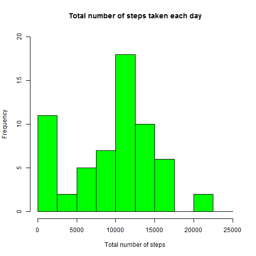
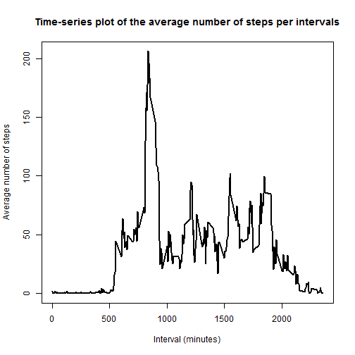
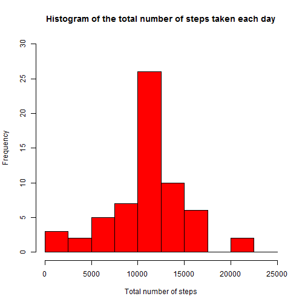

#This is a report as part of the reproducible research report

Loading and preprocessing the data

##1. Load the data (i.e. read.csv())

#load the data

```r
if(!file.exists('activity.csv')){
        unzip('activity.zip')
}
activityData <- read.csv('activity.csv', stringsAsFactors=FALSE)
```
##2. Process/transform the data (if necessary) into a format suitable for analysis

```r
#change date to actual date format
activityData$date <- as.POSIXct(activityData$date, format="%Y-%m-%d")

#isolate the weekdays
activityData <- data.frame(date=activityData$date, 
                           weekday=tolower(weekdays(activityData$date)), 
                           steps=activityData$steps, 
                           interval=activityData$interval)

#check if it is weekend or weekday
activityData <- cbind(activityData, 
                      daytype=ifelse(activityData$weekday == "saturday" | 
                      activityData$weekday == "sunday", "weekend", "weekday"))

#create the data format
activityNew <- data.frame(date=activityData$date, 
                       weekday=activityData$weekday, 
                       daytype=activityData$daytype, 
                       interval=activityData$interval,
                       steps=activityData$steps)
```
###study the header and structure of data

```r
head(activityNew)
```

```
##         date weekday daytype interval steps
## 1 2012-10-01  monday weekday        0    NA
## 2 2012-10-01  monday weekday        5    NA
## 3 2012-10-01  monday weekday       10    NA
## 4 2012-10-01  monday weekday       15    NA
## 5 2012-10-01  monday weekday       20    NA
## 6 2012-10-01  monday weekday       25    NA
```

```r
str(activityNew)
```

```
## 'data.frame':	17568 obs. of  5 variables:
##  $ date    : POSIXct, format: "2012-10-01" "2012-10-01" ...
##  $ weekday : Factor w/ 7 levels "friday","monday",..: 2 2 2 2 2 2 2 2 2 2 ...
##  $ daytype : Factor w/ 2 levels "weekday","weekend": 1 1 1 1 1 1 1 1 1 1 ...
##  $ interval: int  0 5 10 15 20 25 30 35 40 45 ...
##  $ steps   : int  NA NA NA NA NA NA NA NA NA NA ...
```
##What is the mean total number of steps taken per day?

###For this part of the assignment, you can ignore the missing values in the dataset

###1. Make a histogram of the total number of steps taken each day

```r
totalData <- aggregate(activityNew$steps, by=list(activityNew$date), FUN=sum, na.rm=TRUE)

#rename heading
names(totalData) <- c("date", "total")

#plot histogram
hist(totalData$total, 
     breaks=seq(from=0, to=25000, by=2500),
     col="green", 
     xlab="Total number of steps", 
     ylim=c(0, 20), 
     main="Total number of steps taken each day")
```


###2. Calculate and report the mean and median total number of steps taken per day

```r
meanData<-mean(totalData$total)
medianData<-median(totalData$total)
```
###The mean and median are 9354.23 and 10395, respectively

##What is the average daily activity pattern?

###1. Make a time series plot (i.e. type = "l") of the 5-minute interval (x-axis) and the ###average number of steps taken, averaged across all days (y-axis)

```r
#calculate the means of steps for all days for each interval
meanSteps <- aggregate(activityNew$steps, by=list(activityNew$interval), 
                       FUN=mean, na.rm=TRUE)

#rename heading
names(meanSteps) <- c("interval", "mean")
```
###structure of data

```r
str(meanSteps)
```

```
## 'data.frame':	288 obs. of  2 variables:
##  $ interval: int  0 5 10 15 20 25 30 35 40 45 ...
##  $ mean    : num  1.717 0.3396 0.1321 0.1509 0.0755 ...
```
###plot time series

```r
#plot the time series
plot(meanSteps$interval, 
     meanSteps$mean, 
     type="l", 
     col="black", 
     lwd=2, 
     xlab="Interval (minutes)", 
     ylab="Average number of steps", 
     main="Time-series plot of the average number of steps per intervals")
```


##2. Which 5-minute interval, on average across all the days in the dataset, contains the ##maximum number of steps?

```r
#locate maximum mean
max_pos_mean <- which(meanSteps$mean == max(meanSteps$mean))

#find the value
max_interval <- meanSteps[max_pos_mean, 1]
```
###the average interval is 835

##Imputting the missing values

###1. Calculate and report the total number of missing values in the dataset (i.e. the total ###number of rows with NA???s)

```r
#count number of NAs
NA.count <- sum(is.na(activityNew$steps))
```
###data contains 2304 NAs

##2. Devise a strategy for filling in all of the missing values in the dataset. The strategy ##does not need to be sophisticated. For example, you could use the mean/median for that day, ##or the mean for that 5-minute interval, etc.

```r
#locate NA positions
NA.pos <- which(is.na(activityNew$steps))

#create a vector
meanVector <- rep(mean(activityNew$steps, na.rm=TRUE), times=length(NA.pos))
```
###3. Create a new dataset that is equal to the original dataset but with the missing data ###filled in.

```r
#replace NAs with the mean
activityNew[NA.pos, "steps"] <- meanVector
```
###structure of data is

```r
str(activityNew)
```

```
## 'data.frame':	17568 obs. of  5 variables:
##  $ date    : POSIXct, format: "2012-10-01" "2012-10-01" ...
##  $ weekday : Factor w/ 7 levels "friday","monday",..: 2 2 2 2 2 2 2 2 2 2 ...
##  $ daytype : Factor w/ 2 levels "weekday","weekend": 1 1 1 1 1 1 1 1 1 1 ...
##  $ interval: int  0 5 10 15 20 25 30 35 40 45 ...
##  $ steps   : num  37.4 37.4 37.4 37.4 37.4 ...
```
###4. Make a histogram of the total number of steps taken each day and calculate and report ###the mean and median total number of steps taken per day. Do these values differ from the ###estimates from the first part of the assignment? What is the impact of imputing missing ###data on the estimates of the total daily number of steps?

##calculate total number of steps

```r
totalData2 <- aggregate(activityNew$steps, by=list(activityNew$date), FUN=sum)

#rename heading
names(totalData2) <- c("date", "total")

#calculate the histogram of the total number of steps each day
hist(totalData2$total, 
     breaks=seq(from=0, to=25000, by=2500),
     col="red", 
     xlab="Total number of steps", 
     ylim=c(0, 30), 
     main="Histogram of the total number of steps taken each day")
```


####the code for calculating the mean and median

```r
meanData2<-mean(totalData2$total)
medianData2<-median(totalData2$total)
```
###The mean and median are 10766.19 and 10766.18, respectively

###these numbers differ from the previous estimate.

##Are there differences in activity patterns between weekdays and weekends?

###1. Create a new factor variable in the dataset with two levels -weekdays and weekend ###indicating whether a given date is a weekday or weekend day.

```r
#already implemented is df
head(activityNew)
```

```
##         date weekday daytype interval   steps
## 1 2012-10-01  monday weekday        0 37.3826
## 2 2012-10-01  monday weekday        5 37.3826
## 3 2012-10-01  monday weekday       10 37.3826
## 4 2012-10-01  monday weekday       15 37.3826
## 5 2012-10-01  monday weekday       20 37.3826
## 6 2012-10-01  monday weekday       25 37.3826
```
###2.Make a panel plot containing a time series plot (i.e. type = "l") of the 5- minute ###interval (x-axis) and the average number of steps taken, averaged across all weekday days ###or weekend days (y-axis)

```r
# Load the lattice graphical library
library(lattice)

# Compute the average number of steps taken, averaged across all daytype variable
meanData3 <- aggregate(activityNew$steps, by=list(activityNew$daytype, 
                               activityNew$weekday, activityNew$interval), mean)

#rename the heading
names(meanData3) <- c("daytype", "weekday", "interval", "mean")
```
##Plot the time series

```r
xyplot(mean ~ interval | daytype, meanData3, 
       type="l", 
       lwd=1, 
       xlab="Interval", 
       ylab="Number of steps", 
       layout=c(1,2))
```


